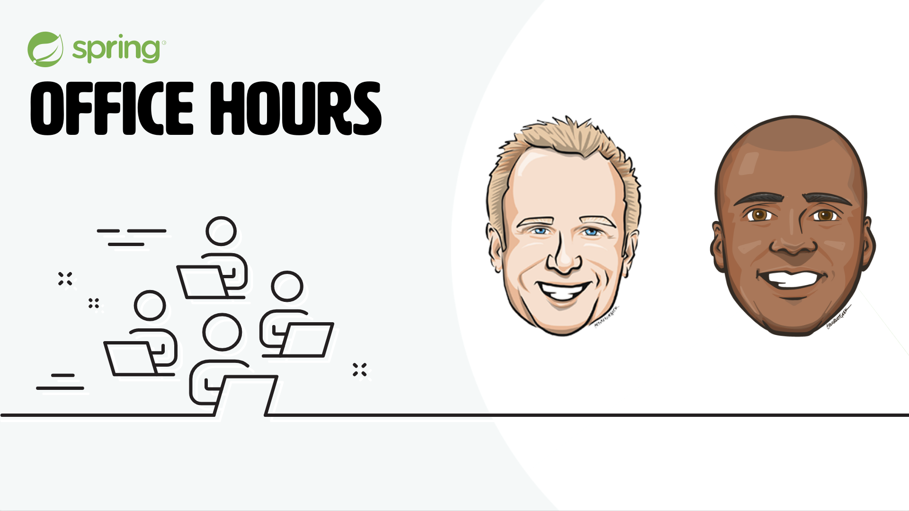

<!-- .slide: data-background-color="#6db33f" -->

# Building Resilient Microservices

### with Spring Cloud

DaShaun Carter | Spring Developer Advocate | [DaShaun.com](https://dashaun.com) <!-- .element: style="color: white" -->

Spencer Gibb | Spring Cloud Cofounder | [gibb.tech](https://gibb.tech) <!-- .element: style="color: white" -->

Notes:
Good morning. I'm DaShaun Carter, a Spring Developer Advocate, and for the next four hours we are going to build a small fleet of microservices that actually survives production.

Pre-flight (run before going on stage)
- JDK 21+ active (`sdk env` in the repo, or `java -version` shows 21).
- `docker compose up -d` from the repo root — RabbitMQ, Redis, and Grafana LGTM.
- `cd labs/bbq-wednesday && ./mvnw -q -DskipTests package` so every jar is cached.
- IDE open at labs/bbq-wednesday.

Running this deck
- `jwebserver -d docs -p 8000` (JDK 21+ built-in static server), open http://localhost:8000.
- Press **S** for speaker view (notes + timer + next slide).

Reveal.js navigation
- **Right / Left** — jump between modules (Intro, Config, Discovery, Resilience, Stream, Gateway, Tracing, Wrap).
- **Down / Up** — move through the slides inside a module.
- **Esc** — overview; **F** fullscreen; **B** black screen.
- The two-dimensional layout means you can SKIP a module by pressing Right — the workshop still flows.

Likely questions
- Q: Do I need all the infrastructure running the whole time? A: No. Config and Discovery need nothing but the JVM. RabbitMQ arrives in Stream, Redis in Gateway, LGTM in Tracing.
- Q: Can I catch up if I fall behind? A: Every exercise is followed by an answer slide, and labs/bbq-wednesday is a complete, compiling reference.

---

## Now We Are Connected

### [DaShaun.com](https://dashaun.com)

Slides, the code, upcoming events, and every social link live there.

Notes:
Twenty seconds. This is the durable place to find the materials after today.

Likely questions
- Q: Where does the finished code live? A: labs/bbq-wednesday in this repo is the reference implementation; it compiles and runs as-is.

---



### [SpringOfficeHours.io](https://springofficehours.io)

Notes:
Brief personal connection. Do not spend workshop time on the show — a sentence, then move on.

---

## What We're Building: BBQ Wednesday

A live audience survey about **Kansas City barbecue**.

- Burnt ends, sauce, sides — you will vote from your phone.
- Every vote flows through the same production patterns real systems use.
- By lunch, the room is driving a distributed system we built together.

> The domain is fun on purpose. The architecture is dead serious.

Notes:
Minute 3-5.
Set the tone. The survey is a reskin of Ryan Baxter's spring-survey-app; the point is that a "toy" domain still needs discovery, config, resilience, messaging, a gateway, security, and tracing — exactly like the serious systems in the room.

Likely questions
- Q: Is this real Kansas City BBQ opinion? A: The questions are real. The burnt-ends debate is the only genuinely dangerous part of this workshop.

---

## Microservices: the good and the bill

**The good:** independent deploys, independent scaling, team autonomy, fault isolation.

**The bill you didn't expect:**

- Where is `results-service` right now? (**discovery**)
- How do I change a setting without a rebuild? (**config**)
- What happens when one service is down or slow? (**resilience**)
- How do services talk without being wired together? (**messaging**)
- One front door, one place for security & throttling? (**gateway**)
- A request touched six services — where did the time go? (**tracing**)

Notes:
Minute 5-8.
This slide IS the workshop outline. Each pain point is a module. Spring Cloud is not a framework you adopt wholesale; it is a toolbox where each tool answers one of these questions.

Likely questions
- Q: Do I need all of Spring Cloud? A: No. Adopt one capability at a time. That's exactly how we'll build it.
- Q: Is a monolith wrong? A: Not at all. These same patterns (config, resilience, tracing) help a modular monolith too. Distribution just makes them mandatory.

---

## The Target Architecture

```text
                      [ survey-ui ]   (browser: Chart.js)
                            │
                     ┌──────▼──────┐   security · rate limit · routing
                     │   gateway   │   :8080
                     └──────┬──────┘
             ┌──────────────┴──────────────┐
      ┌──────▼───────┐   RabbitMQ    ┌──────▼───────┐
      │survey-service│──"bbq-votes"─▶│results-service│
      │   :8081/2    │◀── HTTP tally │    :8083      │
      └──────────────┘               └──────────────┘
             ▲  every service registers with, and reads config from  ▲
        [ eureka-server :8761 ]        [ config-server :8888 ]
```

Notes:
Minute 8-12.
Walk the diagram once. survey-service accepts votes and PUBLISHES events; results-service CONSUMES them and aggregates; the gateway is the only public door; eureka and config-server are the plumbing every service depends on. Traces (not drawn) thread through all of it.

Likely questions
- Q: Why two survey-service instances? A: To show client-side load balancing and discovery doing real work.
- Q: Why both an event AND an HTTP call between the two services? A: Deliberately. The event drives the tally (async, resilient by nature); the HTTP tally read is our lab subject for Resilience4j.

---

## The Version Contract

| Technology | Version | Role |
|---|---:|---|
| Spring Boot | `4.0.7` | application runtime |
| Spring Cloud | `2025.1.2` | Oakwood — the Boot 4 train |
| Java | `21` | language level |
| RabbitMQ | `4.x` | Spring Cloud Stream binder |
| Redis | `7.x` | gateway rate limiter |
| Grafana LGTM | latest | traces, metrics, logs |

The versions are fixed. The BBQ opinions are yours.

Notes:
Minute 12-14.
Spring Cloud tracks Spring Boot through named release trains. "Oakwood" (2025.1.x) is the train built for Spring Boot 4 and Spring Framework 7. Pin the train, let it manage every `spring-cloud-*` version — never set those by hand.

Likely questions
- Q: Why not the newest Boot patch? A: 2025.1.2 explicitly targets the Boot 4.0.x line; we pin a known-good pair rather than chase patches during a workshop.
- Q: Where do I set the train? A: `spring-cloud.version` property + the `spring-cloud-dependencies` BOM import in the root pom.

---

## The Repository

```text
building-resilient-microservices-with-spring-cloud/
├── docker-compose.yml         # RabbitMQ · Redis · Grafana LGTM
├── docs/                      # this deck
└── labs/bbq-wednesday/
    ├── config-repo/           # externalized config (served by config-server)
    ├── eureka-server/         # :8761  service registry
    ├── config-server/         # :8888  centralized configuration
    ├── gateway/               # :8080  routing · security · rate limiting
    ├── survey-service/        # :8081  questions · votes · publishes events
    ├── results-service/       # :8083  consumes events · live tally
    └── survey-ui/             # :8091  Chart.js front end
```

Notes:
Minute 14-16.
One multi-module Maven build. Each module is a real Spring Boot app. We add one Spring Cloud capability per module of the workshop, and the finished tree is exactly what's on screen.

Likely questions
- Q: Is config-repo a separate git repo? A: In production, yes. Here it's a folder the Config Server reads in "native" mode so the lab stays offline. We'll show the git-backed version too.

---

## Lab Setup — 6 Minutes

```bash
# from the repo root
docker compose up -d           # rabbit, redis, lgtm (needed later)

cd labs/bbq-wednesday
sdk env                        # JDK 21 (or ensure java -version is 21+)
./mvnw -q -DskipTests package  # build all six services
```

You should see `BUILD SUCCESS` for six modules.

Notes:
Minute 16-20.
Kick this off now; Maven can resolve while we start the Config module. Docker images pull in the background. Pair up if someone's build is unhappy.

Likely questions
- Q: package fails on JDK 17? A: This build targets Java 21. `sdk env` selects it from .sdkmanrc, or install any JDK 21+.
- Q: Do I need Docker right now? A: Only later. Config and Discovery run on the JVM alone. But starting the pull now saves time.
- Q: Windows? A: Use `mvnw.cmd`. Everything else is identical.
